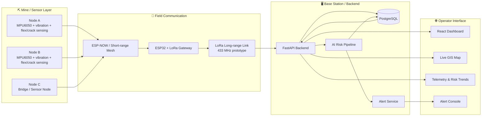
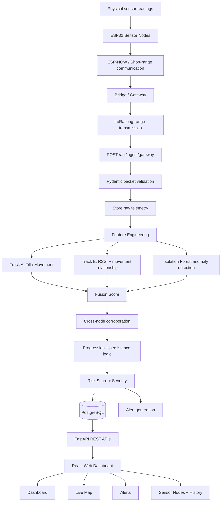
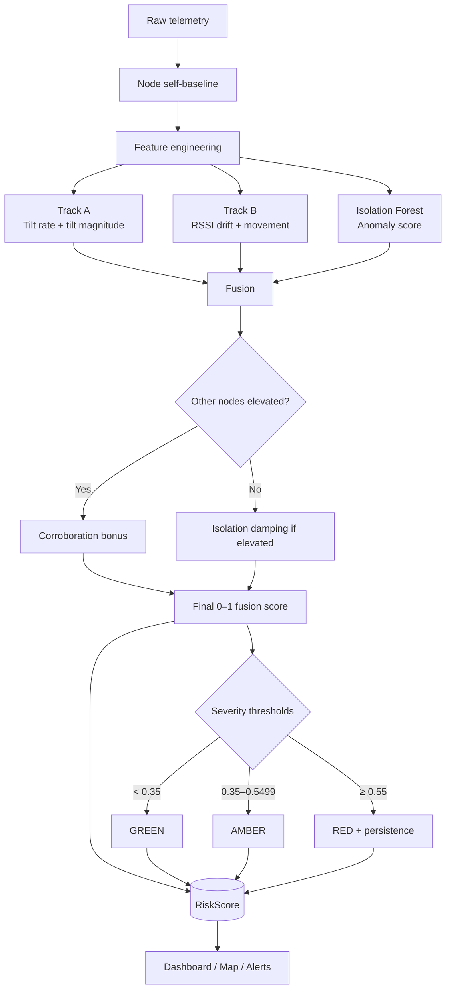
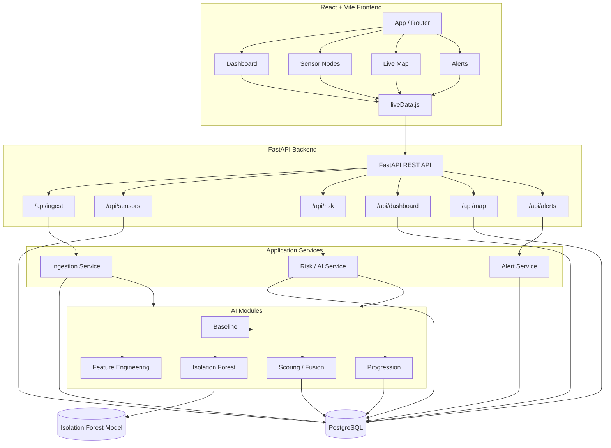

# ⛏️ MineGuard — AI-Powered Mine Safety Monitoring System

> **Nexora | Smart India Hackathon 2026**  
> **Distributed sensing • Edge/LoRa communication • AI anomaly detection • Real-time GIS monitoring**

MineGuard is a real-time mine safety monitoring prototype designed to detect abnormal ground movement and emerging subsidence risk using a distributed network of sensor nodes.

The system combines **multi-parameter sensing**, **short-range ESP-NOW communication**, a **LoRa long-range gateway**, **PostgreSQL telemetry storage**, a **FastAPI backend**, and a **React-based monitoring dashboard**. An AI pipeline converts incoming sensor measurements into a continuously updated risk score, severity state, and progression signal.

---

## 🚨 The Problem

Underground and remote mining environments can experience ground deformation and structural instability before a visible failure occurs. Monitoring becomes difficult when:

- sensor infrastructure must cover a large or distributed area;
- conventional wired monitoring is expensive or difficult to deploy;
- Wi-Fi/cellular connectivity may be unavailable or unreliable underground;
- isolated sensor readings can create false alarms;
- operators need a single interface for telemetry, trends, map position, risk and alerts.

### Our approach

MineGuard creates a **distributed, low-cost sensing layer** and combines multiple signals before raising a safety state:

**Tilt + vibration + RSSI behaviour → feature engineering → anomaly detection → multi-signal fusion → GREEN / AMBER / RED → operator dashboard & alerts**

---

## 💡 Proposed Solution


### Core idea

Each sensor node measures physical conditions and sends telemetry through a mesh/bridge architecture. A gateway forwards the collected packet to the backend. The backend stores raw readings, runs the AI risk pipeline, generates alerts, and exposes the latest state to the web dashboard.

The prototype is designed around three active nodes:

- **Node A** — sensor node
- **Node B** — sensor node
- **Node C** — sensor/bridge node in the physical prototype
- **Gateway** — ESP32 + LoRa communication layer
- **Base Station / Server** — receives gateway data and hosts the software stack

---

# 🏗️ System Architecture



---

# 🔄 End-to-End Data Flow



---

# 🤖 AI / Risk Engine

The AI layer is deliberately designed as a **multi-signal fusion pipeline**, rather than depending on a single sensor threshold.

### 1. Self-baseline calibration

Each node builds its own baseline from initial readings. This allows the system to reason about **deviation from normal behaviour** instead of assuming that every physical node has identical measurements.

The current prototype uses a calibration window of **20 samples**.

### 2. Feature engineering

The backend derives features including:

- tilt magnitude;
- tilt rate;
- tilt acceleration/change in rate;
- vibration RMS;
- RSSI drift;
- RSSI trend;
- rolling tilt behaviour;
- rolling vibration behaviour.

### 3. Track A — movement signal

Track A combines:

- normalized tilt-rate behaviour;
- normalized tilt-magnitude deviation.

Current prototype weighting:

```text
Track A = 70% tilt-rate component + 30% tilt-magnitude component
```

### 4. Track B — communication / movement relationship

Track B uses RSSI drift together with the movement signal. This provides an additional indication when wireless behaviour changes alongside physical movement.

Node C can operate without RSSI; the backend handles missing RSSI by treating its RSSI contribution as unavailable rather than inventing a value.

### 5. ML anomaly detection

The project includes a trained **Isolation Forest** model:

```text
ml/models/isolation_forest.joblib
```

The model is loaded by the backend and receives the engineered feature vector. Its anomaly output is normalized to a `0.0–1.0` score.

### 6. Multi-signal fusion

The current prototype combines:

| Signal | Fusion weight |
|---|---:|
| Tilt / movement track | 50% |
| RSSI relationship track | 25% |
| ML anomaly score | 25% |

The resulting fusion score is normalized to `0.0–1.0` internally and persisted as a **0–100 risk score** in the database/API layer.

### 7. Cross-node corroboration

If multiple nodes become elevated together, the pipeline can apply a corroboration bonus. If a single node is elevated in isolation, the prototype can damp the score to reduce isolated false alarms.

### 8. Severity state

Current prototype thresholds:

| Risk score | State | Meaning |
|---:|---|---|
| `< 35` | 🟢 GREEN | Normal / low risk |
| `35–54.99` | 🟠 AMBER | Elevated / warning |
| `≥ 55` | 🔴 RED | Critical risk |

RED also uses persistence logic, while recovery to GREEN requires repeated low-risk observations. This helps prevent one noisy sample from immediately flipping the system state.

---

# 🧠 AI Pipeline Flowchart



---

# 📡 Hardware / Field Architecture

The proposed field architecture uses low-cost embedded nodes with wireless aggregation.

```text
┌────────────────────────────────────────────────────────────┐
│                    SENSOR / FIELD LAYER                    │
│                                                            │
│  Node A              Node B                Node C           │
│  ESP32               ESP32                 ESP32            │
│  MPU6050             MPU6050               MPU6050          │
│  Vibration           Vibration             Vibration        │
│  Flex / crack        Flex / crack          Bridge role      │
│                                                            │
└───────────────┬──────────────┬───────────────┬─────────────┘
                │              │               │
                └────── ESP-NOW / Mesh ────────┘
                               │
                               ▼
                    ESP32 + LoRa Gateway
                               │
                         LoRa long range
                               │
                               ▼
                         Base Station
                               │
                         FastAPI Backend
                               │
                    ┌──────────┴──────────┐
                    ▼                     ▼
               PostgreSQL             AI Engine
                    │                     │
                    └──────────┬──────────┘
                               ▼
                      React Web Dashboard
```

> **Prototype note:** The repository contains the software prototype and simulator. Hardware/firmware components shown in the solution architecture are represented at the integration boundary by the gateway packet schema and the `bridge.py` serial-to-HTTP bridge.

---

# 🛠️ Technology Stack

## Hardware / Communication

| Layer | Technology |
|---|---|
| Microcontroller | ESP32 |
| Motion sensing | MPU6050 IMU |
| Additional sensing | Vibration, flex/crack sensing |
| Short-range communication | ESP-NOW |
| Long-range communication | LoRa |
| Prototype frequency | 433 MHz |
| Gateway | ESP32 + LoRa |

## Backend

| Technology | Role |
|---|---|
| Python | Core backend / AI language |
| FastAPI | REST API + ingestion server |
| Uvicorn | ASGI server |
| Pydantic | Request validation / schemas |
| SQLAlchemy | Database ORM |
| PostgreSQL | Telemetry, risk and alert storage |
| python-dotenv | Environment configuration |

## AI / Data

| Technology | Role |
|---|---|
| NumPy | Numerical processing |
| Pandas | Feature/model data handling |
| scikit-learn | Isolation Forest anomaly model |
| Joblib | ML model persistence |

## Frontend

| Technology | Role |
|---|---|
| React | Dashboard UI |
| Vite | Frontend build/dev tooling |
| React Router | Page navigation |
| Leaflet + React Leaflet | Live GIS map |
| Recharts | Telemetry/risk charts |
| Lucide React | UI icons |
| CSS | Dashboard styling |

---

# 🧩 Software Architecture

# 🧩 Software Architecture



---

# 📂 Repository Structure

```text
nexora-mineguard/
│
├── app/
│   ├── ai/
│   │   ├── anomaly.py          # Isolation Forest inference
│   │   ├── baseline.py         # Per-node self-baseline
│   │   ├── config.py           # AI thresholds / weights
│   │   ├── features.py         # Feature engineering
│   │   ├── pipeline.py         # Live multi-node AI pipeline
│   │   ├── progression.py      # Movement progression labels
│   │   └── scoring.py          # Track + fusion + severity logic
│   │
│   ├── api/
│   │   ├── ingestion_routes.py
│   │   ├── sensor_routes.py
│   │   ├── risk_routes.py
│   │   ├── dashboard_routes.py
│   │   ├── gis_routes.py
│   │   ├── node_routes.py
│   │   └── alert_routes.py
│   │
│   ├── database/
│   │   ├── base.py
│   │   ├── db.py
│   │   └── dependencies.py
│   │
│   ├── models/                 # SQLAlchemy models
│   ├── repositories/           # Database access helpers
│   ├── schemas/                # Pydantic request schemas
│   ├── services/               # Ingestion, risk and alerts
│   └── main.py                 # FastAPI application
│
├── frontend/
│   ├── src/
│   │   ├── Dashboard.jsx
│   │   ├── SensorNodes.jsx
│   │   ├── LiveMap.jsx
│   │   ├── Alerts.jsx
│   │   ├── liveData.js
│   │   └── ...
│   ├── package.json
│   └── vite.config.js
│
├── ml/
│   └── models/
│       └── isolation_forest.joblib
│
├── scripts/
│   └── replay_data.py
│
│
├── bridge.py                  # Serial/ESP32 → HTTP bridge
├── simulate_live.py           # Live synthetic telemetry simulator
├── create_table.py            # Create PostgreSQL tables
├── test_conn.py               # Database connectivity test
├── requirements-ai.txt
├── .env.example
└── README.md
```

---

# 🔌 API Overview

| Method | Endpoint | Purpose |
|---|---|---|
| `POST` | `/api/ingest/gateway` | Receive gateway telemetry packet |
| `GET` | `/api/sensors/latest` | Latest sensor readings |
| `GET` | `/api/sensors/node/{node_id}/history` | Node telemetry history |
| `GET` | `/api/risk/{node_id}` | Risk history for a node |
| `POST` | `/api/risk/calculate/{node_id}` | Calculate/store node risk |
| `GET` | `/api/dashboard/overview` | Dashboard summary + latest risks |
| `GET` | `/api/map/live` | Live node/GIS status |
| `GET` | `/api/alerts/` | Alert list |
| `GET` | `/api/alerts/active` | Active alerts |
| `PATCH` | `/api/alerts/{id}/ack` | Acknowledge an alert |
| `PATCH` | `/api/alerts/{id}/resolve` | Resolve an alert |

---

# 📨 Gateway Packet

The ingestion endpoint expects a gateway packet containing gateway metadata, bridge metadata and an array of node readings.

Example shape:

```json
{
  "gateway_id": "GATEWAY_01",
  "buffered": false,
  "received_ts": 1720000000,
  "payload": {
    "bridge_id": "C",
    "ts": 1720000000,
    "nodes": [
      {
        "node_id": "A",
        "ts": 1720000000,
        "tilt_x": 0.12,
        "tilt_y": -0.04,
        "vib_rms": 0.08,
        "flex_raw": 2100,
        "crack_ok": true,
        "rssi": -67.0
      }
    ]
  }
}
```

Pydantic validates this structure before the ingestion service processes it.

---

# 🚀 Getting Started

## 1. Clone the repository

```bash
git clone <YOUR_GITHUB_REPOSITORY_URL>
cd nexora-mineguard
```

## 2. Create a Python environment

### Windows PowerShell

```powershell
python -m venv .venv
.\.venv\Scripts\Activate.ps1
```

### Linux / macOS

```bash
python3 -m venv .venv
source .venv/bin/activate
```

## 3. Install backend dependencies

```bash
pip install -r requirements-ai.txt
```

## 4. Configure PostgreSQL

Create a PostgreSQL database and configure the environment variables.

Copy:

```text
.env.example → .env
```

Set:

```env
DB_USER=your_postgres_user
DB_PASSWORD=your_postgres_password
DB_HOST=localhost
DB_PORT=5432
DB_NAME=mineguard
```

> `.env` is intentionally ignored by Git. Never commit real database credentials, API keys or SMS credentials.

## 5. Create the database tables

```bash
python create_table.py
```

## 6. Start FastAPI

```bash
python -m uvicorn app.main:app --reload
```

Backend:

```text
http://127.0.0.1:8000
```

FastAPI documentation:

```text
http://127.0.0.1:8000/docs
```

## 7. Configure the frontend

Inside `frontend/`, create `.env`:

```env
VITE_API_BASE=http://127.0.0.1:8000
```

Install and start:

```bash
cd frontend
npm install
npm run dev
```

Frontend:

```text
http://localhost:5173
```

---

# 🧪 Running the Live Simulator

The repository includes a synthetic telemetry simulator for demonstrating the full pipeline without physical hardware.

Start the backend first, then from the project root:

```bash
python simulate_live.py normal
```

Available scenarios:

```text
normal
isolated
correlated
accelerating
rssi
noise
```

Examples:

```bash
python simulate_live.py normal
python simulate_live.py correlated
python simulate_live.py accelerating
python simulate_live.py rssi
```

The simulator sends readings for **A, B and C** and intentionally keeps the first **20 samples calm** so the backend can establish its self-baseline.

You can also control sample count and interval:

```bash
python simulate_live.py accelerating --samples 100 --interval 0.5
```

---

# 🔬 Scenario Demonstrations

| Scenario | Purpose |
|---|---|
| `normal` | Demonstrates stable baseline / low-risk operation |
| `isolated` | Tests a movement event occurring mainly at Node A |
| `correlated` | Tests movement observed by multiple nodes |
| `accelerating` | Tests increasing movement over time |
| `rssi` | Tests degradation of RSSI on A/B |
| `noise` | Tests response to short sensor spikes |

These scenarios are intended for **prototype validation and demonstration**, not as a substitute for field-calibrated mine measurements.

---

# 🗺️ Dashboard Modules

### 1. Dashboard

Provides the operator with a high-level safety overview:

- overall mine risk state;
- active/critical alerts;
- live system flow;
- node summaries;
- early warning information;
- map context.

### 2. Sensor Nodes

Provides node-level visibility:

- live tilt X/Y;
- tilt magnitude;
- vibration RMS;
- RSSI;
- AI risk score;
- severity;
- progression signal;
- historical charts.

### 3. Live Map

Provides geographic visualization of the sensor network and current node status/risk.

### 4. Alerts

Provides operator-facing alert management, including acknowledgement and resolution actions.

---

# 🖼️ Technical Approach


The technical architecture separates the solution into five logical layers:

```text
┌──────────────────────────────────────┐
│  1. SENSOR / EDGE                    │
│  Raw readings + local preprocessing  │
└──────────────────┬───────────────────┘
                   ▼
┌──────────────────────────────────────┐
│  2. COMMUNICATION                    │
│  ESP-NOW mesh → LoRa gateway         │
└──────────────────┬───────────────────┘
                   ▼
┌──────────────────────────────────────┐
│  3. DATA + BACKEND                   │
│  FastAPI → validation → PostgreSQL   │
└──────────────────┬───────────────────┘
                   ▼
┌──────────────────────────────────────┐
│  4. AI / TRIPLE-LAYER PREDICTION     │
│  Temporal + ML anomaly + RSSI proxy  │
│  → multi-signal fusion               │
└──────────────────┬───────────────────┘
                   ▼
┌──────────────────────────────────────┐
│  5. OPERATOR INTERFACE               │
│  React + GIS + trends + alerts       │
└──────────────────────────────────────┘
```

---

# 🔐 Reliability & Safety Design

MineGuard includes several mechanisms intended to reduce noisy or misleading alerts:

- **Per-node self-baselines** instead of one universal baseline.
- **Multi-signal fusion** instead of relying on a single measurement.
- **Cross-node corroboration** for spatially related events.
- **Isolation damping** for isolated elevated readings.
- **RED persistence** to avoid instant escalation from a single sample.
- **GREEN recovery persistence** to avoid instant recovery after a transient dip.
- **Backend-side validation** before telemetry enters the processing pipeline.
- **Persistent PostgreSQL history** for post-event inspection and trend analysis.
- **Explicit no-data/offline states** in the monitoring layer rather than silently treating missing data as safe.

> MineGuard is a prototype decision-support and monitoring system. It should not be represented as a certified mine-safety system without appropriate field validation, redundancy, regulatory review and safety certification.

---

# 📈 Why This Architecture?

### Low-cost and scalable

ESP32-based nodes and long-range LoRa communication provide a practical architecture for expanding the number of monitored locations without requiring a wired sensor grid everywhere.

### Designed for connectivity-constrained environments

The field layer is designed around local node communication and LoRa backhaul rather than assuming continuous Wi-Fi/cellular availability at every sensor.

### Multi-parameter sensing

Tilt, vibration and RSSI behaviour provide complementary signals. Combining them helps distinguish simple noise from potentially meaningful changes.

### AI-assisted monitoring

The anomaly model provides a learned signal that complements deterministic physical features and thresholds.

### Operator-first visualization

The web interface brings telemetry, historical trends, geographic context, risk severity and alerts into one monitoring surface.

---

# 🧭 Future Roadmap

The current repository is a working software prototype. Potential next steps include:

- [ ] Production ESP32 firmware for all sensor nodes
- [ ] Robust LoRa packet acknowledgement / retry strategy
- [ ] Gateway offline buffering and replay
- [ ] Secure device authentication and signed telemetry
- [ ] MQTT or other production message transport where appropriate
- [ ] More extensive field datasets for ML training
- [ ] Automated model evaluation and drift monitoring
- [ ] Mine-specific calibration and geotechnical validation
- [ ] Battery/energy monitoring and low-power operation
- [ ] More advanced spatial risk modelling
- [ ] SMS/email/push notification hardening
- [ ] Role-based operator authentication
- [ ] Audit logs and incident reports
- [ ] Containerized deployment
- [ ] Production observability and health monitoring

---

# 👥 Team Nexora

**Project:** MineGuard  
**Event:** Smart India Hackathon 2026  
**Theme:** AI-assisted distributed mine safety monitoring

The project brings together embedded sensing, wireless communication, backend engineering, machine learning, database systems and real-time visualization into a single safety-monitoring platform.

---

# 📜 Disclaimer

MineGuard is an **academic/prototype system developed for Smart India Hackathon**. Sensor thresholds, AI scores, simulator data and alert logic must be validated against real mine environments and domain-expert requirements before any operational safety decision is based on the system.

---

## ⭐ If you found this project useful

Star the repository and follow the project as we continue improving the MineGuard prototype.
